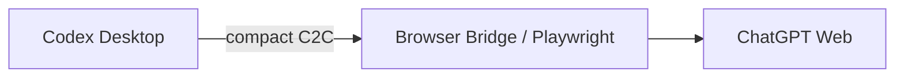
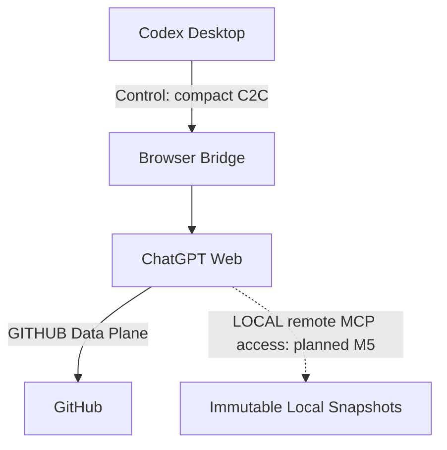
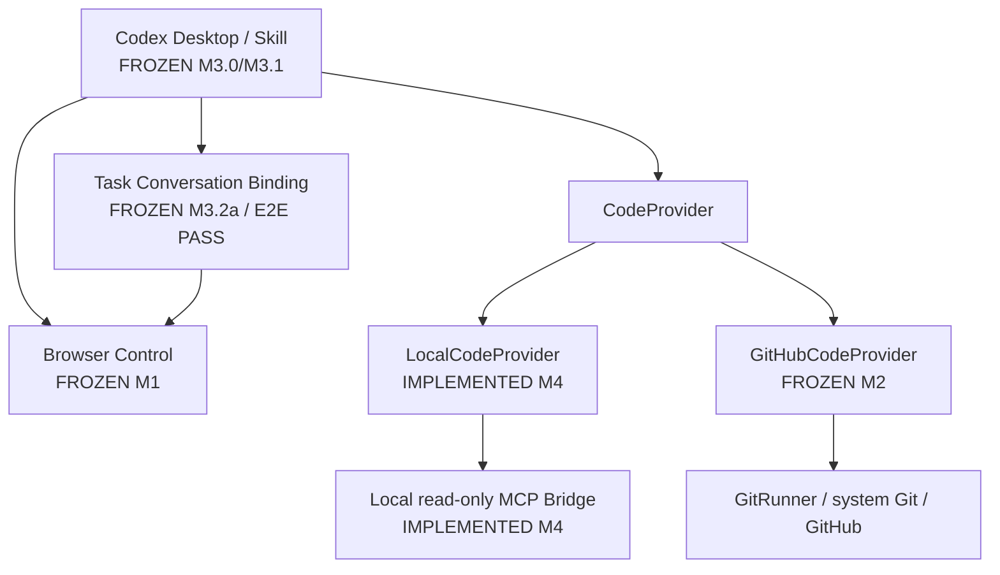

# Architecture

## Product roles

The primary product path is:

```text
User
  ↓
Codex Desktop
  ↓
codex-duet Skill
  ↓
Codex = Outer Orchestrator + Sole Executor
  ↓
ChatGPT Web = Planner + Architect + Reviewer
```

Codex Desktop accepts and normalizes the user's request, invokes deterministic `chatbridge` primitives, applies the approved plan, runs tests, commits when the selected mode requires it, fixes review findings, asks the user when work is `BLOCKED`, and summarizes the result after `DONE`. Codex is the only workspace executor.

ChatGPT Web plans, designs, and reviews. It does not modify the workspace, execute shell commands, commit, or push. `chatbridge` supplies deterministic infrastructure: C2C, state validation, Browser Control Plane, GITHUB task/ref safety, LOCAL snapshot-bound read-only MCP, and durable orchestration guards. It does not replace Codex reasoning.

The main product path depends on Codex Desktop, not Codex CLI or the Codex SDK. A future headless Codex SDK integration may be an optional mode, but it must not change these responsibilities.

## Control Plane and Data Plane

All modes share the Browser Control Plane:



It carries `PLANNING`, `PLAN`, `EXECUTED`, `REVIEW`, `DONE`, `BLOCKED`, and compact C2C metadata. It never carries a repository archive, large diff, DOM snapshot, accessibility tree, browser storage, or other bulk code context. Browser Bridge is the Control Plane and this boundary is the Frozen M1 contract.

Frozen M0 defines generic C2C syntactic validity, so GitHub context fields remain optional at that layer. M3 GITHUB orchestration adds a stricter lifecycle boundary after parsing: every Planner and Reviewer response must explicitly echo and exactly match durable task identity (`MODE`, repository, task branch, and `BASE_REF`), and Reviewer responses must also match the current durable `REVIEW_REF` and test status. Neither Browser `wait --parse` nor M3 repairs or enriches model output. Generic protocol validity and M3 lifecycle validity are intentionally distinct.

The code Data Plane is mode-specific:



GITHUB mode uses GitHub. LOCAL mode implements a loopback read-only MCP endpoint and a separate M5 authenticated remote development service; live ChatGPT acceptance remains pending. Source and large diffs belong on the selected Data Plane, never the Browser Control Plane.

See [Data planes](data-plane.md), [GITHUB mode](github-mode.md), and [LOCAL mode](local-mode.md).

## Mode/provider architecture



Both providers plug into one C2C/state-machine/orchestration core. There must not be separate orchestration engines for LOCAL and GITHUB modes.

`GitRunner` and the system Git CLI remain authoritative for correctness-critical local Git state and transport: status, branch, `HEAD`, ancestry, task-branch creation, push, and remote-SHA verification. GitHub Platform features such as pull requests, checks, workflows, and comments remain a separate future capability boundary.

## Current and planned status

| Component                                          | Status                                         |
| -------------------------------------------------- | ---------------------------------------------- |
| C2C protocol and state machine                     | **IMPLEMENTED / FROZEN M0**                    |
| Browser Bridge / `send` and deterministic `wait`   | **IMPLEMENTED / FROZEN M1**                    |
| `GitHubCodeProvider` and safe Git workflow         | **IMPLEMENTED / FROZEN M2**                    |
| Codex Skill and single-round durable orchestration | **FROZEN M3.0**                                |
| Automatic multi-round Review/Fix Loop              | **FROZEN M3.1 / E2E PASS**                     |
| Task-scoped ChatGPT conversation binding           | **FROZEN M3.2a / E2E PASS**                    |
| `EXECUTING` crash reconciliation                   | **M3.2b FROZEN / REAL DESKTOP CRASH E2E PASS** |
| Compact C2C and durable TaskSpec                   | **M3.2c FROZEN / REAL DESKTOP E2E PASS**       |
| Immutable interaction policy and Discussion        | **M3.3 FROZEN / REAL DESKTOP E2E PASS**        |
| `LocalCodeProvider` and Local read-only MCP Bridge | **IMPLEMENTED M4 / LOCAL ACCEPTANCE**          |
| `submit_response` MCP return path                  | **IMPLEMENTED / EXPLICIT CAPABILITY REQUIRED** |
| LOCAL review snapshot/fingerprint contract         | **IMPLEMENTED M4 / SEPARATE LOCAL AUTHORITY**  |
| cloudflared lifecycle and remote MCP exposure      | **M5 FROZEN / REMOTE DEVELOPMENT ACCEPTANCE**  |
| Hardening, packaging, and distribution             | **M6.3 REGRESSION GATED / M6 OPEN**            |

M3 is frozen with real Desktop E2E acceptance. M4's locally testable data plane and lifecycle are frozen; its Browser acceptance uses fixtures. M5 adds a separate authenticated foreground service and owned temporary tunnel; a generated-task real ChatGPT LOCAL loop reached DONE; the single-user development scope is frozen. See [remote development setup](remote-local-mode.md). M4 does not claim production remote access or an independent external review. See the [M4 freeze record](milestones/M4-local-readonly-mcp.md).

## Roadmap ownership

| Milestone | Ownership                                               |
| --------- | ------------------------------------------------------- |
| M0        | Protocol / State Machine                                |
| M1        | Browser Control Plane — **FROZEN**                      |
| M2        | GitHub Data Plane — **FROZEN**                          |
| M3        | Codex Skill + Orchestration — **FROZEN**                |
| M4        | Local Read-Only MCP Data Plane — **LOCAL SCOPE FROZEN** |
| M5        | cloudflared lifecycle / remote MCP exposure             |
| M6        | hardening / packaging / distribution                    |

## Architecture Invariants

Every future milestone must preserve these invariants:

1. Codex is the only Executor.
2. ChatGPT is only the Planner, Architect, and Reviewer.
3. Browser Bridge belongs only to the Control Plane.
4. The Browser Control Plane does not carry bulk code data.
5. The GITHUB code Data Plane is GitHub.
6. The LOCAL code Data Plane is read-only MCP.
7. cloudflared belongs only to LOCAL Data Plane transport.
8. ChatGPT cannot modify the workspace through MCP.
9. GITHUB formal review is immutable `BASE_REF..REVIEW_REF`.
10. LOCAL mode does not require commit or push.
11. GITHUB and LOCAL share one C2C/state-machine/orchestration core.
12. The project does not implement two independent orchestration engines.
13. Codex Desktop is the primary product's outer orchestrator.
14. The primary product path does not depend on Codex CLI or the Codex SDK.
15. A future headless Codex SDK mode is optional and cannot alter the primary architecture.
16. One active durable task binds to one ChatGPT conversation through task-scoped Browser Control Plane metadata.
17. Task-aware Browser operations resolve exact durable conversation identity before browser connection; unscoped M1 discovery remains fail-closed and backward compatible.
18. Conversation binding does not alter C2C, CodeProvider state, or formal review identity.
19. A new task selects exactly one immutable Browser Control provider before Browser side effects; provider fallback is forbidden.
20. Discussion is bounded pre-planning control traffic, never C2C and never code data.

## Recovery and token efficiency

Browser-internal waiting, selector fallback, streaming detection, and text extraction stay inside deterministic TypeScript infrastructure. M1 stores a causal send checkpoint and returns only the complete assistant control payload. A timeout never authorizes Codex to repeat code modifications. Durable orchestration and repository-development crash reconciliation belong to M3; arbitrary external Executor side effects have no exactly-once guarantee.

M3.2a separates task Browser routing into `.chatbridge/runs/<taskId>/browser.json` rather than changing Frozen M3.1 V2 checkpoints. Task-aware send/wait use an exact conversation target and independent pending-send marker; legacy unscoped operations retain workspace-global `.chatbridge/session.json`. See [ADR-013](adr/ADR-013-task-conversation-binding.md).

The M3.2a re-frozen implementation baseline is `61f8565dda0ffc6b24c90116b648368afad1da6b`; `7d9d31206e699d5a878f40abe23fb1aa1d82412e` remains the historical pre-dogfood baseline. Real Desktop acceptance verified blank-new-chat stabilization from generic bootstrap to concrete durable identity, bound Planner and Reviewer waits, immutable binding and `boundAt`, task-scoped pending-send replacement, legacy SessionStore isolation, send-actionability preflight, and strict GITHUB lifecycle response identity. Public evidence uses symbolic conversation identities; real conversation URLs and message IDs remain only in local gitignored Browser Control Plane state.

M3.2b adds no protocol state and does not upgrade Frozen `DuetRunCheckpointV2`. Its design stores iteration-scoped execution baseline and exact-HEAD test evidence in `.chatbridge/runs/<taskId>/iterations/<N>/execution.json`. A read-only inspector classifies the current Git/worktree state; dirty work and valid commits are preserved, never reset or blindly replayed. Conclusive Frozen M2 current-iteration evidence may be adopted into M3 `EXECUTED` without another push. Arbitrary external shell or network side effects remain unverified and outside any exactly-once guarantee. See [ADR-014](adr/ADR-014-executing-crash-reconciliation.md).

M3.2c restores the documented compact Control Plane boundary. New tasks persist a strict normalized `TaskSpecV1` beside the raw request and pin its fingerprint plus the first Planner projection fingerprint in immutable `task-context.json`, then send bounded Planner and Reviewer projections through unchanged C2C/1. Missing or divergent Compact semantic evidence fails before M2 push and never falls back to legacy. The local TaskSpec is semantic authority; the bound conversation is only a semantic cache. Stable role policy is resolved from repository contracts at immutable `BASE_REF`. See [ADR-015](adr/ADR-015-compact-c2c-task-spec-v1.md).

M3.3 adds an immutable per-task interaction policy without changing Frozen `BrowserAutomationSession`. `PLAYWRIGHT_CLI` retains that control plane; `CODEX_BROWSER` is a separately checkpointed Codex Desktop agent handoff. Optional Discussion is a strict, bounded protocol inside PLANNING and must converge before Planner authority. Historical tasks without the sidecar retain their frozen behavior. See [ADR-016](adr/ADR-016-task-interaction-policy-and-discussion.md).
