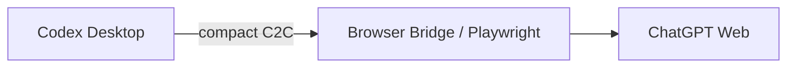
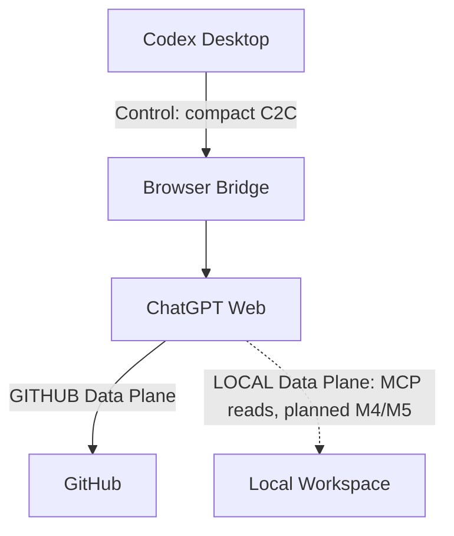
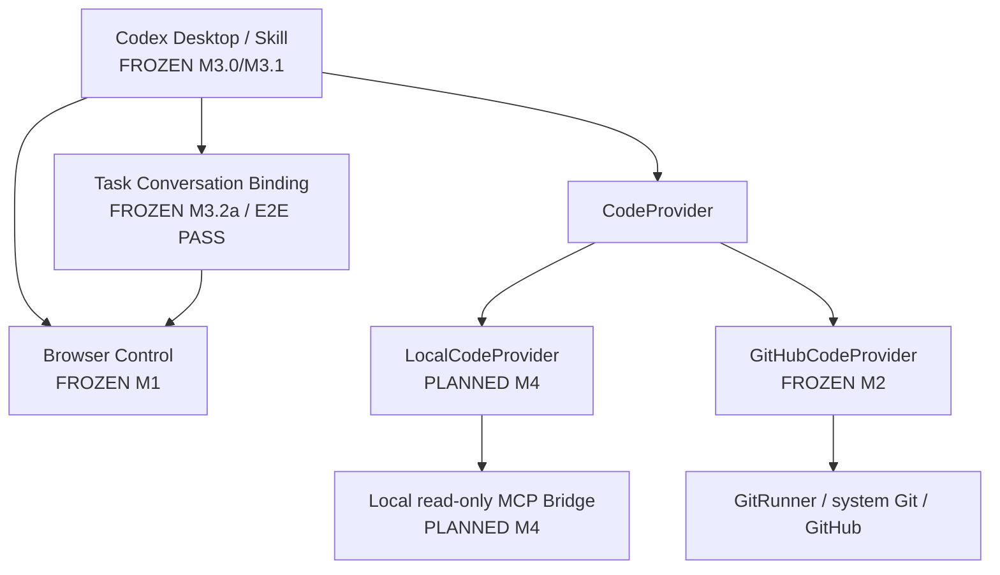

# Architecture

## Product roles

The primary product path is:

```text
User
  ↓
Codex Desktop
  ↓
codex-duet Skill
  ↓
Codex = Outer Orchestrator + Sole Executor
  ↓
ChatGPT Web = Planner + Architect + Reviewer
```

Codex Desktop accepts and normalizes the user's request, invokes deterministic `chatbridge` primitives, applies the approved plan, runs tests, commits when the selected mode requires it, fixes review findings, asks the user when work is `BLOCKED`, and summarizes the result after `DONE`. Codex is the only workspace executor.

ChatGPT Web plans, designs, and reviews. It does not modify the workspace, execute shell commands, commit, or push. `chatbridge` supplies deterministic infrastructure: the C2C protocol, state validation, Browser Control Plane, GITHUB task/ref safety, the planned LOCAL read-only MCP bridge, and durable orchestration guards. It does not replace Codex reasoning.

The main product path depends on Codex Desktop, not Codex CLI or the Codex SDK. A future headless Codex SDK integration may be an optional mode, but it must not change these responsibilities.

## Control Plane and Data Plane

All modes share the Browser Control Plane:



It carries `PLANNING`, `PLAN`, `EXECUTED`, `REVIEW`, `DONE`, `BLOCKED`, and compact C2C metadata. It never carries a repository archive, large diff, DOM snapshot, accessibility tree, browser storage, or other bulk code context. Browser Bridge is the Control Plane and this boundary is the Frozen M1 contract.

The code Data Plane is mode-specific:



GITHUB mode uses GitHub. LOCAL mode will use a read-only MCP endpoint. Source and large diffs belong on the selected Data Plane, never the Browser Control Plane.

See [Data planes](data-plane.md), [GITHUB mode](github-mode.md), and [LOCAL mode](local-mode.md).

## Mode/provider architecture



Both providers plug into one C2C/state-machine/orchestration core. There must not be separate orchestration engines for LOCAL and GITHUB modes.

`GitRunner` and the system Git CLI remain authoritative for correctness-critical local Git state and transport: status, branch, `HEAD`, ancestry, task-branch creation, push, and remote-SHA verification. GitHub Platform features such as pull requests, checks, workflows, and comments remain a separate future capability boundary.

## Current and planned status

| Component                                          | Status                      |
| -------------------------------------------------- | --------------------------- |
| C2C protocol and state machine                     | **IMPLEMENTED / FROZEN M0** |
| Browser Bridge / `send` and deterministic `wait`   | **IMPLEMENTED / FROZEN M1** |
| `GitHubCodeProvider` and safe Git workflow         | **IMPLEMENTED / FROZEN M2** |
| Codex Skill and single-round durable orchestration | **FROZEN M3.0**             |
| Automatic multi-round Review/Fix Loop              | **FROZEN M3.1 / E2E PASS**  |
| Task-scoped ChatGPT conversation binding           | **FROZEN M3.2a / E2E PASS** |
| `LocalCodeProvider` and Local read-only MCP Bridge | **PLANNED M4**              |
| `submit_response` MCP return path                  | **PLANNED M4**              |
| LOCAL review snapshot/fingerprint contract         | **DEFERRED TO M4**          |
| cloudflared lifecycle and remote MCP exposure      | **PLANNED M5**              |
| Hardening, packaging, and distribution             | **PLANNED M6**              |

M3 can first complete the loop in GITHUB mode. A complete LOCAL loop depends on M4 and M5.

## Roadmap ownership

| Milestone | Ownership                                   |
| --------- | ------------------------------------------- |
| M0        | Protocol / State Machine                    |
| M1        | Browser Control Plane — **FROZEN**          |
| M2        | GitHub Data Plane — **FROZEN**              |
| M3        | Codex Skill + Orchestration                 |
| M4        | Local Read-Only MCP Data Plane              |
| M5        | cloudflared lifecycle / remote MCP exposure |
| M6        | hardening / packaging / distribution        |

## Architecture Invariants

Every future milestone must preserve these invariants:

1. Codex is the only Executor.
2. ChatGPT is only the Planner, Architect, and Reviewer.
3. Browser Bridge belongs only to the Control Plane.
4. The Browser Control Plane does not carry bulk code data.
5. The GITHUB code Data Plane is GitHub.
6. The LOCAL code Data Plane is read-only MCP.
7. cloudflared belongs only to LOCAL Data Plane transport.
8. ChatGPT cannot modify the workspace through MCP.
9. GITHUB formal review is immutable `BASE_REF..REVIEW_REF`.
10. LOCAL mode does not require commit or push.
11. GITHUB and LOCAL share one C2C/state-machine/orchestration core.
12. The project does not implement two independent orchestration engines.
13. Codex Desktop is the primary product's outer orchestrator.
14. The primary product path does not depend on Codex CLI or the Codex SDK.
15. A future headless Codex SDK mode is optional and cannot alter the primary architecture.
16. One active durable task binds to one ChatGPT conversation through task-scoped Browser Control Plane metadata.
17. Task-aware Browser operations resolve exact durable conversation identity before browser connection; unscoped M1 discovery remains fail-closed and backward compatible.
18. Conversation binding does not alter C2C, CodeProvider state, or formal review identity.

## Recovery and token efficiency

Browser-internal waiting, selector fallback, streaming detection, and text extraction stay inside deterministic TypeScript infrastructure. M1 stores a causal send checkpoint and returns only the complete assistant control payload. A timeout never authorizes Codex to repeat code modifications. Full task checkpoints and exactly-once execution belong to M3.

M3.2a separates task Browser routing into `.chatbridge/runs/<taskId>/browser.json` rather than changing Frozen M3.1 V2 checkpoints. Task-aware send/wait use an exact conversation target and independent pending-send marker; legacy unscoped operations retain workspace-global `.chatbridge/session.json`. See [ADR-013](adr/ADR-013-task-conversation-binding.md).

The M3.2a frozen implementation baseline is `7d9d31206e699d5a878f40abe23fb1aa1d82412e`. Real Desktop acceptance verified explicit multiple-tab bootstrap, bound Planner wait, exact missing-tab reopen for review send and Reviewer wait, immutable binding and `boundAt`, task-scoped pending-send replacement, and legacy SessionStore isolation. Public evidence uses symbolic conversation identities; real conversation URLs and message IDs remain only in local gitignored Browser Control Plane state.
