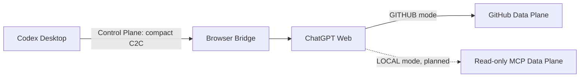

# Control Plane and Data Planes

Status: GITHUB **IMPLEMENTED / FROZEN M2**; LOCAL **PLANNED M4/M5**

The Browser Bridge is the shared Control Plane. It transports compact C2C lifecycle messages between Codex Desktop and ChatGPT Web. Code context travels through a separate, mode-specific Data Plane.

For new M3.2c tasks, Codex Desktop normalizes the private raw request into a local durable `TaskSpecV1`. Browser carries only a bounded role-specific projection. Repository policy, architecture, source, and diffs are read through GitHub or future LOCAL MCP. TaskSpec is not a replacement repository Data Plane.

The Control Plane may carry `PLANNING`, `PLAN`, `EXECUTED`, `REVIEW`, `DONE`, `BLOCKED`, and compact metadata. It may not carry repositories, source archives, large diffs, DOM snapshots, accessibility trees, browser storage, or credentials.

## Mode comparison

| Capability                    | LOCAL | GITHUB                |
| ----------------------------- | ----- | --------------------- |
| ChatGPT code Data Plane       | MCP   | GitHub                |
| Browser Bridge                | Yes   | Yes                   |
| C2C Protocol                  | Yes   | Yes                   |
| Codex = Executor              | Yes   | Yes                   |
| ChatGPT = Planner/Reviewer    | Yes   | Yes                   |
| Read uncommitted files        | Yes   | No                    |
| Read working-tree diff        | Yes   | No                    |
| Commit required before Review | No    | Yes                   |
| Push required                 | No    | Yes                   |
| GitHub required               | No    | Yes                   |
| Local MCP                     | Yes   | No                    |
| cloudflared                   | Yes   | No                    |
| Private/unpushed repository   | Yes   | No GitHub requirement |
| Immutable GitHub `REVIEW_REF` | No    | Yes                   |

LOCAL entries describe the planned M4/M5 architecture, not currently shipped capability. The two modes share one C2C protocol, state machine, Browser Control Plane, and orchestration core; only the `CodeProvider` and review identity differ.

## GITHUB Data Plane

ChatGPT reads commits and diffs from GitHub. Codex must commit and push the task branch, verify the remote SHA, and identify formal review with immutable full-SHA `BASE_REF..REVIEW_REF`. GITHUB mode has no Local MCP or cloudflared dependency.

## LOCAL Data Plane

ChatGPT will read the current workspace through a public HTTPS MCP endpoint routed by cloudflared to a localhost-only, read-only MCP bridge. It may inspect uncommitted files and diffs without GitHub. Its snapshot/fingerprint review identity and optimized `submit_response` return path are deferred to M4; tunnel lifecycle belongs to M5.
