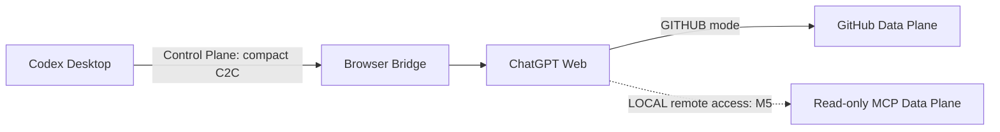

# Control Plane and Data Planes

TaskInteractionPolicyV1 selects a Browser Control Plane provider, not a code Data Plane. Both `CODEX_BROWSER` and `PLAYWRIGHT_CLI` may carry only compact control messages. Neither may carry repository source or diffs, and provider selection cannot change GitHub or LOCAL code authority. Optional Discussion is likewise Control Plane traffic and remains outside C2C.

Status: GITHUB **IMPLEMENTED / FROZEN M2**; LOCAL **FROZEN M4 LOCAL SCOPE / REMOTE M5 PLANNED**

The Browser Bridge is the shared Control Plane. It transports compact C2C lifecycle messages between Codex Desktop and ChatGPT Web. Code context travels through a separate, mode-specific Data Plane.

Codex Desktop normalizes the private raw request into a durable TaskSpec. Browser carries only a bounded role-specific projection. Repository policy, architecture, source, and diffs are read through GitHub or snapshot-bound LOCAL MCP. TaskSpec is not a replacement repository Data Plane.

The Control Plane may carry `PLANNING`, `PLAN`, `EXECUTED`, `REVIEW`, `DONE`, `BLOCKED`, and compact metadata. It may not carry repositories, source archives, large diffs, DOM snapshots, accessibility trees, browser storage, or credentials.

## Mode comparison

| Capability                    | LOCAL | GITHUB                |
| ----------------------------- | ----- | --------------------- |
| ChatGPT code Data Plane       | MCP   | GitHub                |
| Browser Bridge                | Yes   | Yes                   |
| C2C Protocol                  | Yes   | Yes                   |
| Codex = Executor              | Yes   | Yes                   |
| ChatGPT = Planner/Reviewer    | Yes   | Yes                   |
| Read uncommitted files        | Yes   | No                    |
| Read working-tree diff        | Yes   | No                    |
| Commit required before Review | No    | Yes                   |
| Push required                 | No    | Yes                   |
| GitHub required               | No    | Yes                   |
| Local MCP                     | Yes   | No                    |
| cloudflared                   | Yes   | No                    |
| Private/unpushed repository   | Yes   | No GitHub requirement |
| Immutable GitHub `REVIEW_REF` | No    | Yes                   |

LOCAL reads use immutable Git-worktree snapshots, not live-file fallback. The cloudflared/remote-ChatGPT row remains planned for M5; M4 provides local MCP integration. Both modes share C2C, state transitions, Browser Control Plane and response ingress; CodeProvider and formal review identity differ.

## GITHUB Data Plane

ChatGPT reads commits and diffs from GitHub. Codex must commit and push the task branch, verify the remote SHA, and identify formal review with immutable full-SHA `BASE_REF..REVIEW_REF`. GITHUB mode has no Local MCP or cloudflared dependency.

## LOCAL Data Plane

The localhost-only MCP library exposes eight bounded read tools against exact task/snapshot identities, including uncommitted files and snapshot-bound diffs without GitHub. `LocalReviewTargetV1` binds baseline/current/previous snapshots plus immutable test and execution evidence; it is not a GitHub REVIEW_REF. Disabled-by-default `submit_response` authenticates an exact task/control capability and enters the shared lifecycle ingress. Public HTTPS, remote access and cloudflared are unimplemented M5 work. See [LOCAL mode](local-mode.md).
