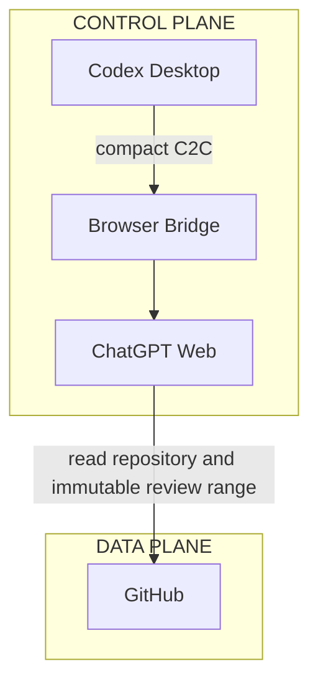

# GITHUB mode

Status: **IMPLEMENTED / FROZEN M2**

Frozen implementation baseline: `f4b1dd012f79b8a6522f56d40d46f7af39a14923`

GITHUB mode uses the shared Browser Control Plane for compact C2C messages and GitHub as the code Data Plane. It does not use Local MCP, a workspace MCP server, cloudflared, or a local tunnel.

## Architecture



## Task and review sequence

```mermaid
sequenceDiagram
    participant U as User
    participant C as Codex / Skill
    participant B as Browser Bridge
    participant W as ChatGPT Web
    participant G as GitHub
    U->>C: Request
    C->>C: M2 init-task; create agent/task-taskId
    C->>B: PLANNING (BASE_REF)
    B->>W: compact C2C
    W->>G: Read repository at BASE_REF
    W-->>C: PLAN through deterministic browser wait
    C->>C: Edit, test, commit
    C->>G: M2 prepare-review; push task branch
    C->>G: Verify remote SHA
    C->>B: EXECUTED (BASE_REF, REVIEW_REF)
    B->>W: compact C2C
    W->>G: Review BASE_REF..REVIEW_REF
    W-->>C: PLAN, DONE, or BLOCKED
```

Because GitHub is the Data Plane, ChatGPT cannot review an uncommitted working tree in this mode. Codex must commit and push before formal review.

## Git responsibilities and safety

Correctness-critical operations use `GitRunner` and the system Git CLI:

- status, current branch, and `HEAD`
- commit ancestry
- task-branch creation
- push
- `ls-remote` verification

One task owns exactly one generated branch:

```text
agent/task-<taskId>
```

Formal review identity is exactly:

```text
BASE_REF..REVIEW_REF
```

Both values are immutable full 40-character commit SHAs. Branches, tags, `HEAD`, remote-tracking names, short SHAs, and other moving refs are forbidden as formal review identities. After push, the remote task-branch SHA must equal the local `REVIEW_REF`.

The Frozen M2 implementation supplies task/ref safety, verified push, persistence, CLI commands, and compact review-envelope primitives. See [the M2 milestone](milestones/M2-github-mode.md) and [ADR-008](adr/ADR-008-immutable-github-review-range.md).
