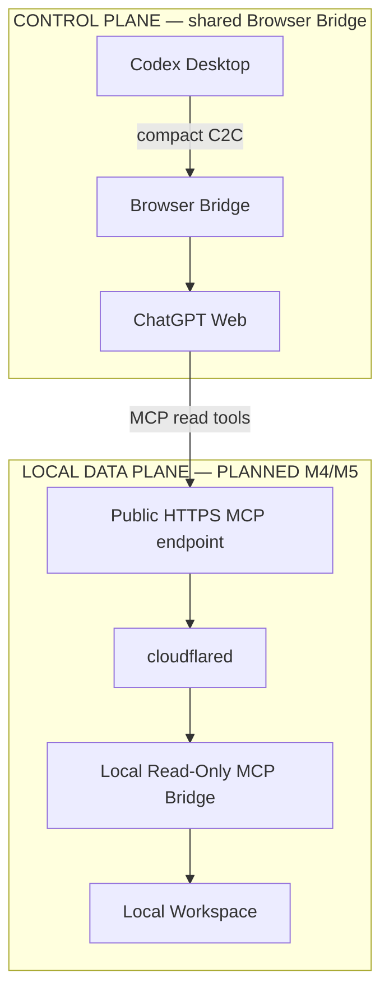
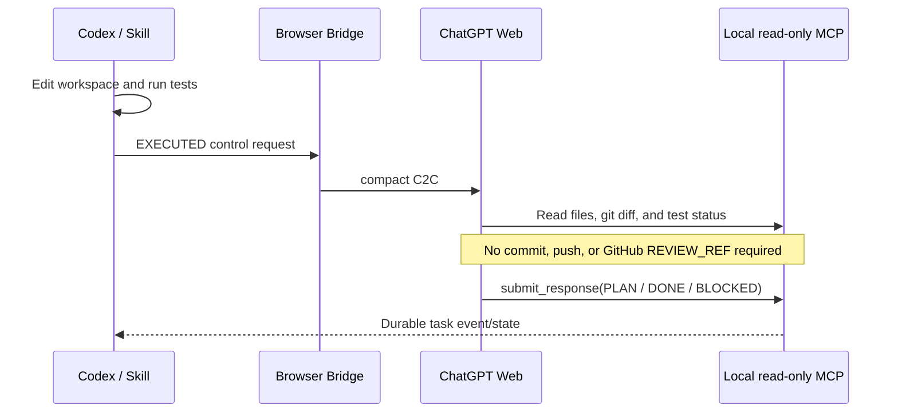

# LOCAL mode

Status: **PLANNED M4/M5**

LOCAL mode is for private, unpushed, or uncommitted workspaces. It preserves Codex as the sole Executor while allowing ChatGPT Web to read the current workspace through a bounded, read-only MCP Data Plane. Nothing in this document claims that Local MCP, `submit_response`, or cloudflared is implemented.

## Target architecture



The Data Plane will expose private repository files, unpushed commits, an uncommitted working tree, Git diffs, local documentation, test status, and an execution summary without uploading the code to GitHub.

## Review sequence



LOCAL mode permits review of uncommitted state. Its review identity must not pretend that the observation is a Git commit:

```text
LOCAL Review Snapshot / Fingerprint contract: DEFERRED TO M4
```

M4 must bind each review to a reliable, explicit local workspace observation or snapshot. It must not reuse the GITHUB `REVIEW_REF` contract without a separate design.

## Current and target response paths

The implemented Frozen M1 return path is:

```text
send → deterministic wait → final browser response
```

The optimized LOCAL target for M4/M5 is:

```text
ChatGPT
  ↓
submit_response(taskId, iteration, state, content)
  ↓
Local Bridge durable task event/state
  ↓
Codex Skill
```

The target avoids repeated agent-driven page snapshots, DOM reading, or browser polling. It does not replace or retroactively change the current deterministic M1 `send/wait` contract.

## Read-only MCP tools

The planned workspace read surface is limited to:

```text
workspace_info
list_directory
read_file
search_workspace
git_status
git_diff
test_status
execution_summary
```

The planned control/return tool is:

```text
submit_response
```

`submit_response` may write only `.chatbridge` internal task/run state. It cannot write workspace content. The MCP server must never expose `write_file`, `delete_file`, `exec`, `shell`, `git_commit`, or `git_push`.

## Security requirements

Before M4 ships, the Local MCP Bridge must enforce:

- canonical workspace-root sandboxing
- path-traversal protection
- symlink-escape protection
- sensitive-file deny policy
- request and response size limits
- `taskId` and iteration validation
- state-transition validation
- secret-safe logging

The deny policy must reject `.env`, `*.pem`, `*.key`, SSH credentials, cloud credentials, token files, and password/secret-like files by default. See [Security](security.md).

## cloudflared role

cloudflared is only the planned LOCAL Data Plane transport:

```text
Internet HTTPS endpoint
        ↓
cloudflared tunnel
        ↓
localhost MCP server
```

It maps remote HTTPS to the local MCP service. It is not a browser-control channel, Codex message channel, or Git transport. Its lifecycle and controlled remote exposure belong to M5.
