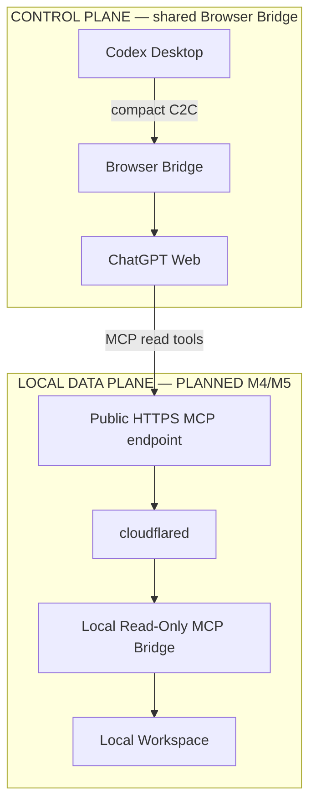
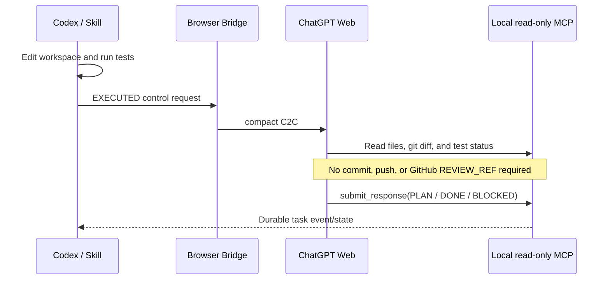

# LOCAL mode

Status: **M4 IN PROGRESS; M5 PLANNED**

LOCAL mode is for private, unpushed, or uncommitted workspaces. It preserves Codex as the sole Executor. Immutable Git-worktree snapshots, snapshot-bound read services, a loopback MCP server library, optional capability-scoped response ingress, and the data-plane CLI below are implemented. The complete LOCAL task lifecycle and remote ChatGPT access are not yet integrated. cloudflared remains M5.

## Implemented data-plane CLI

Run at a Git worktree root with an existing HEAD. No remote is required; pre-existing dirty files are permitted. These commands create task-scoped metadata under `.chatbridge`, but never commit, push, execute tests, send messages or approve review results. `duet` remains the existing GITHUB lifecycle entry point; these commands do not substitute for a LOCAL PLAN/Discussion/execution gate.

```text
chatbridge local init-task --task demo
chatbridge local assert-ready --task demo
chatbridge local capture --task demo
chatbridge local record-evidence --task demo --evidence-file .chatbridge/evidence-input.json
chatbridge local prepare-review --task demo --iteration 1
chatbridge local status --task demo
```

Initialize before editing to preserve the baseline. After authorized edits, capture a candidate, run tests yourself against that candidate, then supply its exact snapshot identity in the evidence file. Keep the input file under `.chatbridge` or outside the workspace so creating it does not change the review surface. `record-evidence` verifies live state still matches the named snapshot; it records the caller's assertion, not independent proof that tests ran.

The evidence file is a strict JSON object with `tests` and `execution` fields. Both contain `version: 1`, `taskId`, positive `iteration`, exact `snapshotId`, and a `summary` string. `tests` additionally requires `status` (`PASS`, `FAIL`, or `NOT_RUN`) and `recordedAt` (ISO timestamp). Preserve the complete original input for immutable replay; changing its timestamp or summary is not an identical retry.

`prepare-review` requires matching durable evidence and returns a `LocalReviewTargetV1`, never a GitHub `REVIEW_REF`. The current prepared iteration replays its immutable target even after live edits; `assert-ready` separately rejects live drift. New iterations must be sequential. The drift check is not execution authorization. `init-task` recovers existing context only when live state still matches the baseline or latest review; do not use it to reset a dirty in-progress task.

### Task semantics and control projection

Place both LOCAL contract documents in the workspace before initializing its baseline. Normalize the task into `LocalTaskSpecV1` with the baseline context returned by `init-task`, canonical SHA-256 integrity, and `AT_BASELINE_SNAPSHOT` contract resolution. See [ADR-018](adr/ADR-018-local-task-spec-control.md) for the identity and response rules.

```text
chatbridge local bind-task-spec --task demo --request-file .chatbridge/request.txt --task-spec-file .chatbridge/spec-input.json
chatbridge local project-control --task demo
chatbridge local project-control --task demo --review
```

Bind before editing; the first projection produces Planner control. The `--review` form requires an already-prepared review target. Output is JSON with an `envelope` string, not a send operation. Oversize messages fail without truncation. TaskSpec binding, compact LOCAL projections and response-identity validation are implemented, but connecting them to the selected Browser provider, optional Discussion, full lifecycle crash/resume acceptance and M4 freeze remains pending.

After run-init, `project-control` is refused: use the exact `control` from run-status or a lifecycle command, including all accepted user decisions.

Snapshot-bound MCP tools expose allowed repository files read-only. LOCAL has separate Planner/Reviewer contracts resolved at baseline, without changing frozen M3.2c or GITHUB contracts. The [durable lifecycle core](adr/ADR-019-local-lifecycle-core.md) reuses shared transitions and response ingress with separate LOCAL persistence.

### Guarded lifecycle CLI

The [stored gates](adr/ADR-020-local-stored-gates.md) and lifecycle commands now support exact CODEX_BROWSER evidence:

```text
chatbridge local run-init --task demo
chatbridge local run-status --task demo
chatbridge local confirm-control --task demo
chatbridge local ingest-response --task demo --message-file .chatbridge/response.txt
chatbridge local begin-execution --task demo
chatbridge local reconcile-execution --task demo
chatbridge local run-prepare-review --task demo
```

Persist an explicit interaction policy using the existing interaction-policy workflow before run-init. Enabled Discussion must already have complete, verified convergence evidence; a manually written CONVERGED summary cannot bypass the Browser artifact check.

Use the [LOCAL Discussion commands](adr/ADR-021-local-discussion-recovery.md) after binding TaskSpec and before run-init:

```text
chatbridge local discussion-prepare --task demo --round 1 --request-file .chatbridge/question.txt
chatbridge local discussion-ingest --task demo --message-file .chatbridge/discussion-response.json
chatbridge local discussion-status --task demo
chatbridge local discussion-recover --task demo
```

Preparation returns `control` and `controlFile`. Send the exact file through the selected Browser workflow, including its terminal newline, and record the received Browser bytes before Discussion ingestion. A next round requires the previous outcome CONTINUE and an explicit next round number; the limit is three. Retrying the same round/question recovers its original control, not a new send. Status is read-only; recover repairs a missing or stale summary only from validated immutable round evidence. BLOCKED and FAILED never auto-continue.

Use the existing Codex Browser interaction commands to prepare, attempt, confirm and receive the exact control/response bytes. `confirm-control` validates that evidence; it does not send. `ingest-response` requires the exact recorded Browser response. After PLAN is accepted, begin-execution records intent; the caller edits and tests, uses capture/record-evidence, then run-prepare-review persists EXECUTED. Confirm and receive the Reviewer exchange before ingesting the result.

`reconcile-execution` observes an EXECUTING run without advancing it: UNCHANGED, WORKTREE_IN_PROGRESS or REVIEW_PREPARED. Snapshot metadata may be stored, but no source edits, tests, new review targets or sends occur. REVIEW_PREPARED also reports live drift; explicitly use run-prepare-review to recover the published target.

`chatbridge local run-cancel --task demo --reason "operator stop"` durably terminates a cancellable run without reverting code or retracting transport operations. Repeating the same reason is idempotent. Historical response replay cannot revive cancellation. See [ADR-022](adr/ADR-022-local-reconciliation-cancellation.md).

For a lifecycle BLOCKED response, obtain the user's in-scope clarification and save its exact text outside the reviewable surface:

```text
chatbridge local resume-blocked --task demo --blocked-control-sha256 <blocked-control-sha256> --decision-file .chatbridge/decision.txt --scope-unchanged
```

This appends a bound decision and returns PLANNING with a new control, not execution permission. Send, confirm and receive through the selected Browser workflow and accept a fresh PLAN before beginning execution. Reviewer blocking at N resumes planning for N+1 against the reviewed snapshot. The original TaskSpec is unchanged; scope or requirement changes require a new task. Exact retries preserve the decision and never consume a later block. See [ADR-023](adr/ADR-023-local-blocked-user-decisions.md). Pre-run Discussion blocking is not handled by this lifecycle command.

PLAYWRIGHT_CLI remains refused until its exact-proof adapter is implemented. The default Browser CLI ingress also refuses new MCP-source responses. Explicitly enabled loopback servers can use the authenticated [MCP lifecycle adapter](adr/ADR-024-local-mcp-lifecycle-ingress.md): capability checks do not bypass confirmed Browser send, identity, state or live-snapshot guards. Accepted MCP replies leave Browser state truthful; matching durable acceptance permits the next control without inventing a Browser response. No automatic provider switch occurs. Real Browser E2E and final M4 acceptance remain pending.

## Target architecture



The Data Plane will expose private repository files, unpushed commits, an uncommitted working tree, Git diffs, local documentation, test status, and an execution summary without uploading the code to GitHub.

## Review sequence



LOCAL mode permits review of uncommitted state. Its review identity must not pretend that the observation is a Git commit:

```text
LOCAL Review Snapshot / Fingerprint contract: ADR-017
```

The implemented provider binds each review to explicit immutable snapshots and a review-target fingerprint under [ADR-017](adr/ADR-017-local-review-identity.md). It does not reuse the GITHUB `REVIEW_REF` contract.

## Current and target response paths

The implemented Frozen M1 return path is:

```text
send → deterministic wait → final browser response
```

The optimized LOCAL target for M4/M5 is:

```text
ChatGPT
  ↓
submit_response(taskId, iteration, state, content)
  ↓
Local Bridge durable task event/state
  ↓
Codex Skill
```

The target avoids repeated agent-driven page snapshots, DOM reading, or browser polling. It does not replace or retroactively change the current deterministic M1 `send/wait` contract.

## Read-only MCP tools

The implemented server library's workspace read surface is limited to:

```text
workspace_info
list_directory
read_file
search_workspace
git_status
git_diff
test_status
execution_summary
```

The disabled-by-default, capability-scoped control/return tool is:

```text
submit_response
```

`submit_response` may write only `.chatbridge` internal task/run state. It cannot write workspace content. The MCP server must never expose `write_file`, `delete_file`, `exec`, `shell`, `git_commit`, or `git_push`.

## Security requirements

Before M4 ships, the Local MCP Bridge must enforce:

- canonical workspace-root sandboxing
- path-traversal protection
- symlink-escape protection
- sensitive-file deny policy
- request and response size limits
- `taskId` and iteration validation
- state-transition validation
- secret-safe logging

The deny policy must reject `.env`, `*.pem`, `*.key`, SSH credentials, cloud credentials, token files, and password/secret-like files by default. See [Security](security.md).

## cloudflared role

cloudflared is only the planned LOCAL Data Plane transport:

```text
Internet HTTPS endpoint
        ↓
cloudflared tunnel
        ↓
localhost MCP server
```

It maps remote HTTPS to the local MCP service. It is not a browser-control channel, Codex message channel, or Git transport. Its lifecycle and controlled remote exposure belong to M5.
